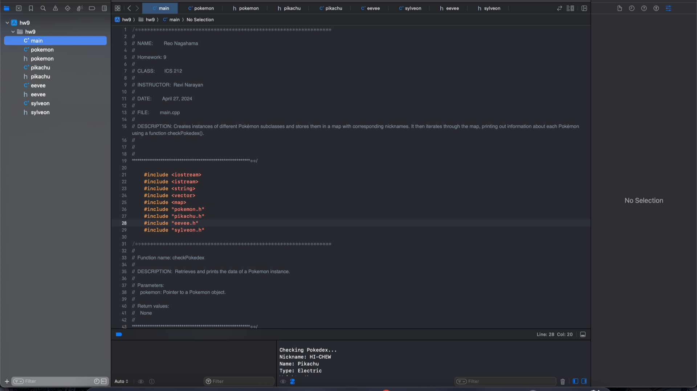

  

The "Pokedex" project is a simple C program I developed during my sophomore year as part of an ICS class assignment. The program allows users to input various details about Pokémon, such as their names, nicknames, and weights, which can later be printed to the console. It was a straightforward introduction to handling user input and managing data in C, providing a foundational understanding of basic concepts.

While this project may not be overly complex, it served as an important learning experience in my coding journey. By working on this project, I gained practical skills in programming logic, data handling, and user interaction, which are essential for more advanced projects in the future. It was a small but significant step in building my confidence and proficiency in C programming.

Looking ahead, I am eager to expand on the knowledge and skills gained from this project. My goal is to create more sophisticated programs that integrate similar principles but on a larger scale. This project has inspired me to explore further possibilities in software development, and I hope to continue building on this foundation as I progress in my studies and career.
